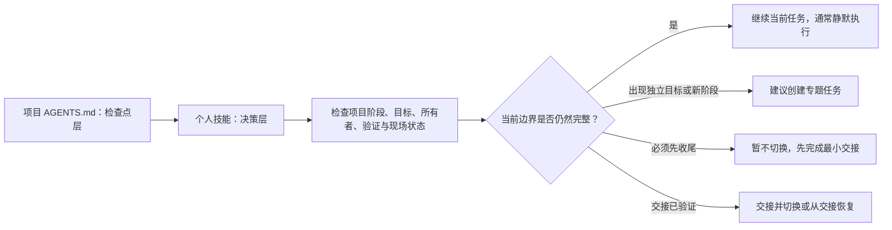

# Manage Project Sessions

一个用于复杂软件项目的 Codex 个人技能。它帮助 Codex 主动判断当前任务是否应该继续、拆分、交接或切换，并把关键项目状态保存在可验证的项目事实中，而不是依赖越来越长的聊天记录。

## 它解决什么问题

复杂项目通常不会因为一次对话结束而结束。随着需求、架构、实现、调试、验收和发布不断推进，容易出现这些问题：

- 对话很长，但没人能准确判断是否应该切换任务；
- 新任务开得太早，关键决策、验证结果和现场状态没有交接；
- 所有工作都堆在一个任务中，旧假设和失败路径持续污染后续判断；
- 项目总控、功能开发、故障诊断和验收混在一起，目标边界越来越模糊；
- 新任务只能依赖复制整段聊天记录，无法从项目文件和实际运行状态恢复；
- 用户必须主动提醒 AI 检查会话边界，但用户自己也未必知道何时该切换。

这个技能把“是否切换任务”变成一项基于证据的项目决策，而不是按消息数、上下文长度或主观感觉判断。

## 运行机制：默认两层会话管理

技能默认采用两层机制：



### 第一层：个人技能决策

`$manage-project-sessions` 负责判断边界。它会检查：

- 当前目标和停止条件是否仍然一致；
- 项目是否进入了新的阶段或语义所有者；
- 已完成、未完成和未验证事项是否清楚；
- Git、测试、运行进程、配置、日志等现场状态是否需要保留；
- 当前上下文是否积累了过多失效假设、矛盾或失败路径；
- 新任务能否仅凭项目事实和交接材料安全恢复。

它最终只给出一个建议：

- 继续当前任务；
- 创建专题任务；
- 完成交接后切换；
- 从交接恢复；
- 暂不切换。

### 第二层：项目检查点

项目级 `AGENTS.md` 或已有的等效项目指令负责提醒 Codex：在实质性任务开始或结束、阶段变化、长时间诊断、独立验收、发布准备、上下文漂移等节点，主动调用这个技能检查边界。

技能首次进入复杂项目的重要检查点时，会只读审计项目层，将其分类为：

- `adopted`：两层机制已经启用；
- `missing`：缺少项目检查点规则；
- `conflicting`：存在重复、覆盖或冲突规则；
- `unverified`：无法可靠确定有效规则。

缺少规则时，技能只会提出建议。只有用户明确授权后，才会写入项目指令文件。

> 这不是后台常驻监控。Codex 只能在收到用户或系统任务并开始工作时执行检查，不能在没有任务运行时自行唤醒。

### 专题任务的工作目录

用户明确授权创建本项目的专题任务后，技能默认让新任务直接使用当前项目的 **Local** 工作目录。这个选择会被显式传给任务创建工具，不会因为项目是 Git 仓库就沿用宿主“优先 Worktree”的默认行为。

只有两种情况改用 **Worktree**：

- 用户明确要求并行隔离；
- 已发现真实写入冲突风险，例如另一个并行写入者会修改重叠文件或同一事实所有者，要求不兼容的分支基线，或会争用无法安全共享的构建、生成文件、依赖或配置状态。

只读并行、项目使用 Git、任务较长、专题不同，或仅仅存在另一个没有并行写入计划的任务，都不能单独成为使用 Worktree 的理由。创建前或创建时，Codex 会向用户说明使用 Local 或 Worktree 以及对应证据；如果必须隔离但当前项目或宿主不能创建 Worktree，则停止创建并说明原因。

### 正式写代码前的 Codex 模式门

在当前项目会话第一次正式写代码前，技能必须先通过宿主提供的任务元数据检查当前会话是否处于 **Codex 模式**。源码、测试、可执行脚本，以及会改变可执行行为的构建或配置写入都受此门禁约束。

以下信息不能代替模式确认：模型名称、项目是 Git 仓库、已经打开工作区、能够运行命令、看起来具备文件编辑能力，或对话正在讨论代码。如果宿主表明当前是 ChatGPT、ChatGPT Work、普通聊天或其他非 Codex 会话，或者无法可靠提供当前会话模式，技能会在首次代码写入前停止，并提醒用户切换到 Codex 模式。

如果宿主模式仍然未知，而用户明确表示已经把当前会话切换到 Codex 模式，技能会接受这项用户确认并继续，同时记录门禁依据是用户确认而不是宿主确认。该回退不能覆盖宿主当前明确给出的非 Codex 状态。只读检查、诊断、计划、交接和普通说明文档编辑不触发此门禁，但不能借这些活动夹带代码改动。

## 触发机制

### 1. 显式触发

直接在请求中提及技能：

```text
$manage-project-sessions 判断当前任务是否应该切换。
```

也可以直接描述目标：

```text
请检查当前项目的会话结构，并为下一阶段准备交接。
```

适合显式触发的请求包括：建立项目总控任务、创建专题任务、评估当前边界、生成交接、从交接恢复，以及启用或审计两层策略。

### 2. 隐式触发

当请求与技能描述匹配时，Codex 可以自动选择这个技能，例如：

- 开始或完成一项实质性工作；
- 从需求进入架构、实现、验收或发布阶段；
- 工作切换到另一个子系统或主要交付物；
- 调试持续很久并积累多个失败方案；
- 开始独立评审、验收、项目接管或跨时间继续；
- 当前对话出现上下文漂移或矛盾。

### 3. 项目检查点触发

启用第二层后，即使用户没有说“会话”“任务切换”或技能名称，项目指令也会要求 Codex 在关键节点执行轻量检查。如果判断结果是“继续当前任务”且不需要用户操作，技能会安静地继续工作，不额外增加管理仪式。

## 安装

克隆仓库：

```powershell
git clone https://github.com/jamthy/manage-project-sessions.git
```

Windows PowerShell：

```powershell
New-Item -ItemType Directory -Force "$env:USERPROFILE\.codex\skills" | Out-Null
Copy-Item -Recurse -Force .\manage-project-sessions\manage-project-sessions "$env:USERPROFILE\.codex\skills\"
```

macOS 或 Linux：

```bash
mkdir -p ~/.codex/skills
cp -R ./manage-project-sessions/manage-project-sessions ~/.codex/skills/
```

安装后在 Codex 的技能列表中检查该技能是否出现；如果没有出现，重新启动 Codex 后再次检查。

## 使用方式

### 为项目启用默认两层策略

在项目目录中告诉 Codex：

```text
请使用 $manage-project-sessions，为当前项目启用默认两层会话管理策略。
```

这条“启用”请求本身就是对当前项目指令变更的限定授权。Codex 会先查找实际生效的 `AGENTS.md` 或等效指令文件，说明确切目标后写入带有稳定标记的策略块，并检查是否存在重复或冲突规则；如果目标或范围发生变化，则需要重新确认。

### 检查当前任务是否应该切换

```text
请使用 $manage-project-sessions 检查当前任务边界，并告诉我是否应该切换。
```

技能不会按消息数机械切换，而是根据目标、阶段、所有者、验证证据、Git 和运行现场给出一个明确建议。

### 创建专题任务并选择工作目录

普通串行专题任务：

```text
请使用 $manage-project-sessions 为当前项目创建“同步任务校验”专题任务，并继续使用当前项目的 Local 工作目录。
```

需要并行隔离时：

```text
请使用 $manage-project-sessions 创建“发布包独立验收”专题任务；这个任务要与当前实现并行写入，请使用 Worktree 隔离。
```

即使用户没有在普通场景中写出 “Local”，技能也默认选择 Local。只有用户明确要求并行隔离，或技能能指出具体并行写入者与冲突面时，才选择 Worktree。

### 遇到非 Codex 模式

如果当前任务即将进入正式代码写入，但宿主未确认 Codex 模式，技能会停止并提示：

```text
当前会话不是 Codex 模式，或无法确认其为 Codex 模式。请先切换到 Codex 模式；切换后告诉我继续，我会重新检查后再开始写代码。
```

如果重新检查后宿主模式仍然未知，但用户明确确认已经切换，则技能视为门禁通过；如果宿主仍明确显示非 Codex，则继续停止。

### 准备交接

```text
请使用 $manage-project-sessions 完成当前任务收尾，生成经过验证的交接，并给出下一个任务的标题和开场提示词。
```

交接会区分实际完成、尚未完成和未验证事项，并记录变更文件、验证证据、相关 Git 或易变现场状态、下一步安全动作与停止条件。

### 从交接恢复

```text
请使用 $manage-project-sessions 从这份交接继续。先核对项目和运行现场的当前事实，再执行下一步。
```

技能会把交接视为历史快照，而不是无条件相信它仍然正确。

## 三个真实工作场景示例

以下示例来自复杂软件项目中常见的真实工作方式，展示技能在实际任务中的决策过程。

### 场景一：功能开发仍在同一边界内

**现场：** 正在实现“文件同步任务编辑”功能。数据模型、界面、校验和保存逻辑属于同一个已经确认的功能目标，相关讨论仍然有效，测试也能在当前任务中完成。

**触发：** 完成数据模型后准备修改界面，项目检查点自动运行。

**技能判断：** 虽然修改了多个文件，但目标、语义所有者和验收边界没有变化。

**结果：** `继续当前任务`。技能通常不会单独输出会话管理报告，而是继续完成界面和测试，避免为了“对话已经很长”而进行无意义切换。

### 场景二：长时间故障诊断需要先收尾再切换

**现场：** 一个后台服务偶发停止。当前任务已经尝试过权限、路径、网络和计划任务等多个方向，其中部分假设已被日志否定，但结论还没有写入项目事实，运行中的服务和日志位置也没有记录。

**触发：** 技能检测到长时间诊断、多个被否决路径和上下文漂移。

**技能判断：** 新任务有助于获得干净的诊断上下文，但立即切换会丢失失败证据和易变现场。

**结果：** `暂不切换`。先记录已排除假设、关键日志、当前进程和配置状态、未验证边界及下一条最小实验；验证交接后，再建议创建“后台服务停止｜根因诊断”专题任务。

### 场景三：实现完成后进入独立验收与发布准备

**现场：** 一个版本的实现和本地测试已经完成，下一步需要独立审查安装包、首次启动、升级路径和真实环境证据。

**触发：** 项目从实现阶段进入独立验收和发布准备阶段。

**技能判断：** 新阶段具有不同的验收边界，需要尽量减少实现过程中的既有结论对审查的影响。

**结果：** `完成交接后切换`。技能先汇总提交范围、构建与测试证据、尚未验证的真实环境项目、发布回滚方式，然后建议创建“版本候选｜独立验收与发布准备”任务，并生成可复制的开场提示词。

## 语言选择

技能向项目指令写入策略时，按以下顺序确定正文语言：

1. 用户明确指定的语言；
2. 现有指令文件的主语言；
3. 当前对话语言；
4. 项目文档的主语言；
5. 无法判断时使用中文。

固定标记、`$manage-project-sessions`、文件名、命令、代码标识以及 `Codex`、`Git` 等产品名称保持不变。模板只是语义来源，不会强迫中文项目写入英文，也不会强迫英文项目写入中文。

## 安全边界

- 自动审计只读进行，不会因为技能被触发就擅自修改项目文件。
- 创建、进入、重命名、归档或删除 Codex 任务需要用户对具体动作明确授权。
- 正式写代码前必须先检查当前会话模式；宿主模式未知时可接受用户明确的已切换确认，但不能覆盖宿主明确的非 Codex 状态。
- 为本项目创建专题任务时默认使用当前项目的 Local 工作目录；Worktree 只用于用户明确要求的并行隔离或有具体证据的写入冲突。
- 会话管理不会隐式授权修改项目事实、提交、推送、发布、部署或执行破坏性操作。
- 切换之前必须保留实际状态、决策、变更产物、验证证据、未解决事项和下一步安全动作。
- 交接结构校验只能证明材料完整，不能证明其中的项目事实一定正确。

## 仓库结构

```text
manage-project-sessions/
├── agents/openai.yaml
├── assets/
│   ├── agents-session-policy.md
│   └── session-handoff-template.md
├── references/
│   ├── handoff-contract.md
│   ├── project-adoption.md
│   ├── session-model.md
│   └── switch-gates.md
├── scripts/validate_handoff.py
└── SKILL.md
```

## License

[MIT License](LICENSE)
